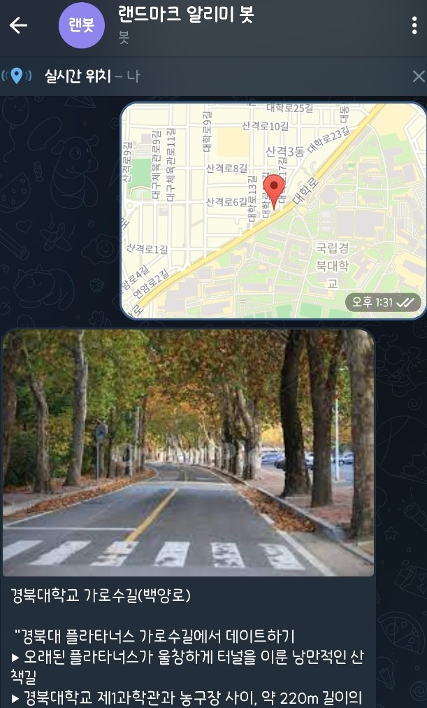
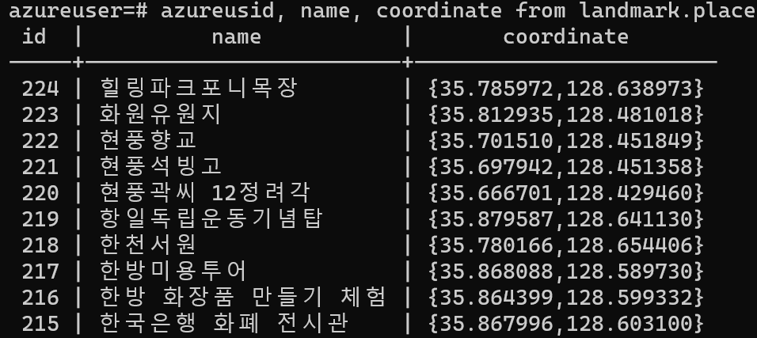

# 2022 대구를 빛내는 SW해커톤

## 팀명
- 풀하우스

## 자율세션
- 자유 관광 사용자를 위한 주변 관광지 정보 실시간 제공 서비스 

## 프로젝트 한 줄 설명
- 대구 자유관광시 데이터와 챗봇을 통해 실시간 정보 제공

## 프로젝트에 대한 설명
- 대구광역시 내를 자유롭게 관광하는 사용자들을 위해 대구 관광 정보 공공 데이터와 구글맵 Rest API를 이용하여 Telegram Bot API를 통해 사용자에게 현재 위치에서 인접한 관광지 정보를  실시간으로 제공한다.

- 이를 통해 사용자는 주변 관광지 정보를 실시간으로 얻을 수 있어 쉽고 효율적으로 대구시 여행을 즐길 수 있다.

- 이를통해 다양한 관광지를 관광을 할 수 있어 대구 여행에 대한 접근성과 여행의 질 상승 효과를 기대할 수 있다.

## 프로젝트에 활용된 기술
- Telegram Bot API

    </img> 

- PostgreSQL

    </img> 

- Google Maps API

## 시연 영상
- 유튜브 시연 영상

    > [랜드마크 알리미 봇](https://www.youtube.com/watch?v=VAqoXJgaPNc, "랜드마크 알리미 봇 링크")